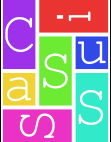

Cassius
=======

Cassius is a formalization of CSS, making it possible to build tools
that reason about the appearance of web pages.

Installing
------------

You'll need to install Racket (6.3 or later) <http://racket-lang.org>
and Z3 <https://github.com/Z3Prover/z3> (latest git; not version
4.4.1). Make sure Z3 is in your path.

Test out your Cassius installation by running, from the top-level directory,

    racket src/run.rkt accept bench/introex.rkt main

This should churn for a few seconds and say, "Accepted".

Using Cassius
----------------

Run Cassius with

    racket src/run.rkt [tool] [file] [instance]

The `./cassius` script runs Cassius. It takes four arguments: the tool
to run, the file to run on, and the example in that file. 

The currently-supported tools are:

- `smt2`: Output constraints generated by Cassius
- `render`: Render the page using a known CSS file
- `sketch`: Synthesize a CSS file from a known rendering
- `verify`: Look for counterexamples to a property
- `debug`: Print out CSS properties responsible for measurement

For example, to run the the `smt2` tool, run:

    racket src/run.rkt smt2 bench/introex.rkt sketch /tmp/out.z3

This puts a file with all the generated constraints into
`/tmp/out.z3`.

Testing Assertions
------------------

To test some assertions on a web page, write the assertion into a
file, such as the `assertions.vizassert` that ships with Cassius. Then
run:

    racket src/run.rkt assertions [assertion-file] [assertion-name] [file] [instance]

An assertion file is formatted like `assertions.vizassert`, which
ships with several assertions drawn from common accessibility and
usability guidelines, including:

- `text-size`: text should be at least 14px tall
- `contrast`: text should have good contrast with background
- `interactive-onscreen`: links, buttons, and inputs should be onscreen
- `overlapping-text`: text should not overlap other text
- `text-width`: text should not be wider than 80 characters
- `line-spacing`: line spacing should be at least 1.5
- `paragraph-spacing`: paragraph spacing should be at least 1.5 line spacing
- `selected-onscreen`: `.selected` items should be onscreen
- `tab-ordering`: tab order should be top down and left to right
- `button-size`: buttons should be at least 30×30px
- `link-distinctive`: links should be a distinct color from normal text
- `no-horizontal-scroll`: no elements should scroll horizontally
- `interactive-distinct`: interactive elements should be a different
  color from non-interactive ones

The chosen assertion will be run on the chosen instance, both the
render tree and browser configuration of any counterexamples will be printed.

Collecting Examples
-----------------------

You can collect examples to run Cassius on from Firefox. If you have
Firefox and the Selenium packages for Python installed, you can run

    python2 get_bench.py URL

to run Firefox on the URL in question and dump the resulting layout
into a file somewhere in `bench/`.

Current Status
--------------

Cassius currently supports a fragment of CSS 2.1:
+ Widths, padding, and margins, including `auto` margins
+ Percentage and em measurements
+ Borders and Margin collapsing
+ Floats and Positioning
+ A few miscellaneous properties, like `box-sizing`.

Cassius development is tracked
[on Trello](https://trello.com/b/ylAVgJh3/cassius). Email
[Pavel Panchekha](mailto:me@pavpanchekha.com) to be added to the
project.
