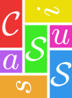

Cassius
=======

Cassius is a formalization of CSS, making it possible to build tools
that reason about the appearance of web pages.

Installing
----------

To capture web pages (needed to use Cassius) you will need:
- Python 3 <https://www.python.org/getit/>
- Firefox <https://www.mozilla.org/en-US/firefox/new/>
- Geckodriver <https://github.com/mozilla/geckodriver/releases>
- Selenium Webdriver (version 3 or later) <https://pypi.org/project/selenium/>
- Typescript (version 2 or later) <https://www.typescriptlang.org/#download-links>
Note that Firefox, Geckodriver, and Selenium must have compatible
versions.

To run Cassius on the captured web pages, you will need:
- Racket (version 6.9 or later) <http://racket-lang.org>
- Z3 (version 4.5 or later) <https://github.com/Z3Prover/z3> Make sure
Geckodriver, Typescript, and Z3 are in your path, and Selenium is in
your Python path.

First, set up Cassius with:

    make setup

Then, test out your Cassius installation by running, from the top-level directory,

    python3 capture/capture.py http://example.com --output bench/example.rkt
    racket src/run.rkt accept bench/example.rkt doc-1

This should churn for a few seconds and say, "Accepted".

Capturing Web Pages
-------------------

To reason about a web page, the page must be *captured*, converted
into Cassius's input format. To capture a web page, run:

    python3 capture/capture.py [urls ...] --output [file]

The URLs may be web pages, accessed through the `http://` or
`https://` protocols, or local files, given either by a `file://` URL
or by a page.

The output `file` is created or overwritten by this command, and
stores one web pages for each given URL. They are named `doc-00N`, for
`N` from 1 to the number of URLs and the number being zero-padded
(these names are referred to as "instances").

Some pages need to be modified before being captured. The `--prerun
[js-file]` flag allows you to specify a file of JavaScript to be run
before capturing the page.

*Note*: The capture script starts a full web browser, so may take a
while to complete. It also creates a visible browser window. Do not
interact with this window! On Linux machines, it is convenient to use
the `xvfb-run` command to hide this window, like so:

    xvfb-run -a python3 capture/capture.py [urls ...] --output [file]

Testing if a Web Page is Supported
----------------------------------

To determine whether Cassius supports a given web page, run

    racket src/run.rkt accept [file] [instance]

This will churn for a while and output either "Accepted" or
"Rejected". If "Accepted" is produced, that means that Cassius's
formalization of browser rendering accepts to rendering produced by
Firefox, a good proxy for whether Cassius supports your web page.

Cassius currently supports a fragment of CSS 2.1:

+ The CSS 2.1 box model: padding, border, and margins
+ Min and max widths and heights
+ Percentage and `em` measurements
+ Colors, foreground and background
+ The `inline`, `block`, and `inline-block` display modes
+ `line-height` and `font-size`
+ `position` and the positioning properties
+ `float` and `clear`

A few miscellaneous properties, like `box-sizing`, are also supported.

Testing Assertions with VizAssert
---------------------------------

To test some assertions on a web page, write the assertion into a
file and run:

    racket src/run.rkt assertions [assertion-file] [assertion-name] [file] [instance]

See `bench/assertions/assertions.vizassert` for an example of the
syntax of assertion files. That file contains several assertions drawn
from common accessibility and usability guidelines, including:

- `text-size`: text should be at least 14px tall
- `contrast`: text should have good contrast with background
- `interactive-onscreen`: links, buttons, and inputs should be onscreen
- `overlapping-text`: text should not overlap other text
- `text-width`: text should not be wider than 80 characters
- `line-spacing`: line spacing should be at least 1.5
- `paragraph-spacing`: paragraph spacing should be at least 1.5 line spacing
- `selected-onscreen`: `.selected` items should be onscreen
- `tab-ordering`: tab order should be top down and left to right
- `button-size`: buttons should be at least 30×30px
- `link-distinctive`: links should be a distinct color from normal text
- `no-horizontal-scroll`: no elements should scroll horizontally
- `interactive-distinct`: interactive elements should be a different
  color from non-interactive ones

The chosen assertion will be run on the chosen instance, and if the
assertion is false, a counterexample render tree will be printed.

Current Status
--------------

Cassius development is tracked
[on Trello](https://trello.com/b/ylAVgJh3/cassius). Email
[Pavel Panchekha](mailto:me@pavpanchekha.com) to be added to the
project.
